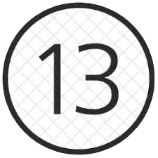

<div align="center">
  
  <h1>Prime Suspect</h1>
  <p>Is this number a prime?</p>
</div>

## Features

Type the keyword (default `@@`) followed by a number:

- **If it's prime** → confirmation, plus a random fun fact about prime numbers.
- **If it's not** → the closest primes above and below it, its prime factorization (e.g. `360 = 2³ × 3² × 5`), and the full list of divisors.

Press <kbd>⏎</kbd> to copy the result to the clipboard, or <kbd>⌥</kbd><kbd>⏎</kbd> to show it in large type.

## Requirements

- [Alfred](https://www.alfredapp.com/) with the **Powerpack**
- Python 3 (ships with macOS)

## Installation

1. Download the latest `.alfredworkflow` file from the [Releases](https://github.com/giovannicoppola/alfred-primeSuspect/releases) page.
2. Double-click it to import into Alfred.

## Usage

```
@@ 17        → 💫 17 is a prime number!  (+ a fun fact)
@@ 360       → ❌ 360 is not prime  →  359 / 367, 360 = 2³ × 3² × 5
@@ banana    → 🚨 This is not an integer…
```

The trigger keyword can be changed in the workflow's user configuration in Alfred.


## About the icon

The icon is a stylized spiral with the prime number **13** at its core — a nod to the
[**Ulam spiral**](https://en.wikipedia.org/wiki/Ulam_spiral).

In 1963, mathematician Stanisław Ulam was (so the story goes) doodling during a dull
meeting. He wrote the positive integers in a square spiral — 1 in the center, then
2, 3, 4, … winding outward — and circled the primes. To his surprise, the primes didn't
scatter randomly: many of them lined up along **diagonal streaks**. Those diagonals
correspond to quadratic polynomials like *n² + n + 41* that are unusually rich in primes.

No one has fully explained the pattern, and it ties into some of the deepest open
questions about how primes are distributed.


## License

[MIT](LICENSE) © Giovanni Coppola
